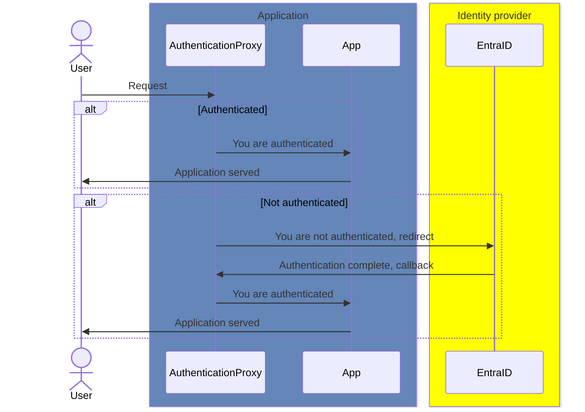
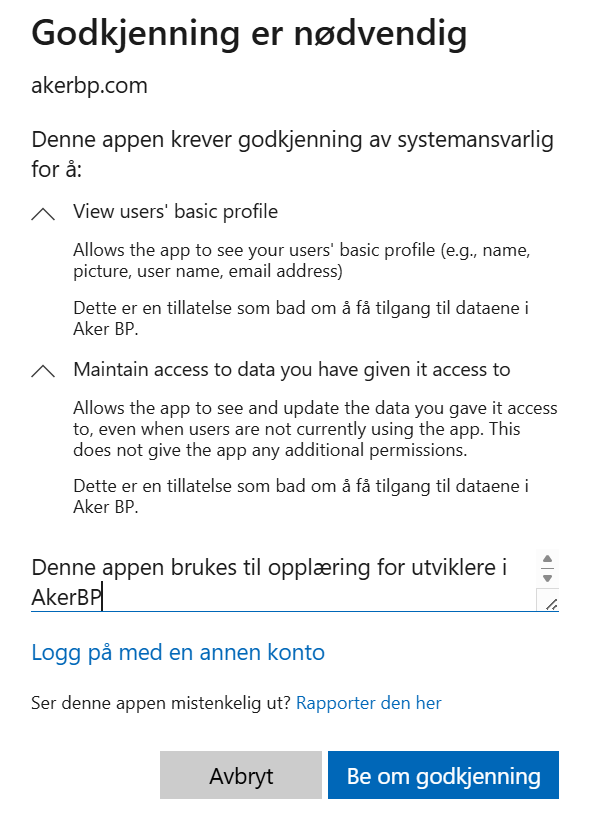

# author-authn-primer
This is a primer on learning different authentication and authorization scenarios
when building web apps that connect to Azure AD.

# Prerequisites
## On your machine
To carry out all operations gone through in this workshop, we need to install the following
software.

- Docker desktop: Install from company portal
- Ubuntu (or other linux) from app store. Follow [this](https://learn.microsoft.com/en-us/windows/wsl/setup/environment)
- Azure cli: Follow [this](https://learn.microsoft.com/en-us/cli/azure/install-azure-cli-linux?pivots=apt)
- `jq`: [Install](https://jqlang.github.io/jq/download/)

## Application registration and enterprise application in Entra ID
To obtain an application registration, fill out the form in ServiceNow. It is located at 

> ServiceNow -> Request catalog -> Azure AD - application registration

| Field | Value |
| ----- | ----- |
| New or existing application | New |
| App registration name | Name of app or use case |
| App owners | Entra ID users who will own the app |
| Justification | Elaborate on app or use case |
| Application type information | My own Azure developed application |
| Certificates and/or secret configuration | Yes |

The other fields can be left as default. After a day or two you should have the app reg and 
enterprise application set up for you, with a client secret sent to your email.


## Change app reg and enterprise application owner

The form only allows us to select regular users, while application registration should only
be owner by admin users. Let's fix this.

```bash
# Find the app reg id 
az ad app list --display-name "<app reg name>" --query "[].appId" --output tsv

# Find your admin user ID
az ad user show --id admin.<user name>@akerbp.com --query id --output tsv

# Add your admin user as owner to the app reg
az ad app owner add --id <app reg id> --owner-object-id <admin user id>

````

Attempts to do the final step of assigning the correct owner to the enterprise application
have failed. There is no Azure CLI command to do this, and using the graph API fails in 
mysterious ways.

A ticket to IT help is currently the only way to do this.

# Verify app works without authentication
## Setup environment file 
To successfully run the app, a few environment variables need to be in place. These are the 
client ID, client secret and a cookie secret. To start filling these out, copy the template
to a real `.env` file

```bash
cp .env-template .env
```

### Create cookie secret
All cookies are encrypted using a secret key. To prevent the possibility of reading and tampering
with the cookie, this secret needs to be unique. There are several ways to do so and they are 
documented [here](https://oauth2-proxy.github.io/oauth2-proxy/configuration/overview/#generating-a-cookie-secret).
One easy way is to type in the terminal

```bash
dd if=/dev/urandom bs=32 count=1 2>/dev/null | base64 | tr -d -- '\n' | tr -- '+/' '-_' ; echo
```

Then the resulting string can be put into the `.env` file.

### Oauth2 properties
The app we requested earlier came with a client secret, it should be sent to you by email. The 
client ID can be found using the Azure CLI,

```bash
az ad app list --display-name <app-registration-name> --query "[].appId" --output tsv
```

Now type those values into their respective variables in the `.env` file.

### Run the app

Now that we have filled out our environment file, we can run the application. To run the application 
and verify that your local development environment is correctly set up, run 

```bash
docker-compose up
```

The app is now running, and visiting `http://localhost:8080/public` should result in the application being 
visible. This endpoint is configured in the oauth2-proxy configuration to not require authentication, using 
the `skip_auth_routes` configuration.

## Setting up authentication
### Try it
The webapp has an endpoint called `http://localhost:8080/behind_proxy`, and it requires authentication.
Try visiting this page.

This should result in an error. The reason is that we have not configured a _callback URL_ yet.

### The callback URL

To understand the callback URL, lets rewind a few steps and learn some of the key elements of how
the authentication proxy works.

When hitting our protected endpoint, the oauth2-proxy roughly follows the following sequence, depending
on whether or not the user is already authenticated.



In the sequence where the user is not authenticated, they are redirected to the identity provider,
and once the user is authenticated they will be issed a set of credentials proving who they are 
(ID token) and what accesses they have (Access token). These credentials are passed to what we 
designate as the _redirect URL_, or _callback URL_ as it is often also called.

Entra ID will only be permitted to pass the credentials to a predefined set of URLs. In our case, 
our authentication proxy is running on `http://localhost:8080` and this URL needs to be added to 
the set of permitted redirect URIs.

To set the correct redirect URL, in bash, again get you application ID and modify it:
```bash
# Get application ID
az ad app list --display-name "<app reg name>" --query "[].appId" --output tsv

# Add redirect URL
az ad app update --id <app_id> --web-redirect-uris "http://localhost/oauth2/callback"
```


### The application permission

Now that we've set the correct callback URL, there is a final issue standing between us and a 
successful single sign-on flow. To make single sign-on work, our application needs the permission 
to call the microsoft graph API to get information about the user who is about to sign in.

Since we're using OpenID Connect, the permissions our application needs are captured in the 
standard OpenID scope, i.e. _email, offline_access, openid, profile_. To configure the app with these
permissions, run

```
az ad app permission add --id <app_id> --api 00000003-0000-0000-c000-000000000000 --api-permissions '7427e0e9-2fba-42fe-b0c0-848c9e6a8182=Scope'
az ad app permission add --id <app_id> --api 00000003-0000-0000-c000-000000000000 --api-permissions '64a6cdd6-aab1-4aaf-94b8-3cc8405e90d0=Scope'
az ad app permission add --id <app_id> --api 00000003-0000-0000-c000-000000000000 --api-permissions '37f7f235-527c-4136-accd-4a02d197296e=Scope'
az ad app permission add --id <app_id> --api 00000003-0000-0000-c000-000000000000 --api-permissions '14dad69e-099b-42c9-810b-d002981feec1=Scope'
```

The _api_ field here refers to the Microsoft Graph API, and the permissions ID of all scopes in 
this API can be looked up [here](https://learn.microsoft.com/en-us/graph/permissions-reference).

At this point we've configured the application to have the permission to access these scopes, 
however configuring it is not sufficient to actually get the permission. Permissions must be granted
by an administrator. To trigger the flow that requests this permissions on behalf of the application, 
try to log in to your application at `http://localhost:8080/behind_proxy`. A dialog should pop up,
looking something like this



Here, you can type your justification for requesting this type of permissions, then a ticket will 
created behind the scenes and processed accordingly. Once the permissions have been granted, you 
should be able to successfully log into the application at `http://localhost:8080/behind_proxy`

If everything has gone as expected, you should now see a page that list all information gathered
about you in the identification process.

### Unpacking the logic

Why and how do we currently have access to this information inside our application?

The authentication proxy has a few options regarding if and how it should pass authentication 
information through to the underlying web application. Specifically, the oauth2-proxy options

```toml
pass_access_token = true
pass_authorization_header = true
```

These settings will ensure that the ID token is passed in the authorization header to the 
upstream web application.

### Decoding the tokens

Both the access token and the ID token can be decoded and inspected easily. In Entra ID, both 
follow the JSON web token standard, meaning they are comprised of headers, a payload and a 
signature.

#### Verify token validity

Before decoding the token we need to verify its validity. Since our app is protected by and
outer shell in the form of the authentication proxy, validating the token is not strictly 
necessary as the proxy takes care of this step. However, we should practice our defense-in-depth 
muscle at all times, therefore we validate the token in the code as well.

The JWT (JSON web token) consists of three parts - header, payload and signature. Token 
validation is based on asymmetric cryptography. In Entra ID, there are several public-private key 
pairs, such as you would find when setting up a regular Github ssh connection. The public keys can 
be found per the application's OpenID configuration, at what is called the _JWKS_uri_.

This URI is used in the code, and can be obtained by 

```bash
curl https://login.microsoftonline.com/3b7e4170-8348-4aa4-bfae-06a3e1867469/v2.0/.well-known/openid-configuration | jq '.jwks_uri'
```

By using the _public key_ we can cryptographically verify that the payload has been signed using 
the _private key_ only known by EntraID. The consequence of this is that we can be sure that the 
token is valid, has been signed by the correct authority, and importantly, it will not have been 
possible to tamper with the payload by an adversary. This means that all information in the payload 
can be trusted.

There are more details to validating, such as checking the _audience_ and token expiry. We will 
not go into those details here.

#### Token decoding

A JWT token is only base64 encoded, meaning that it's content and payload is completely transparent,
and can be decoded by anyone regardless of the signing and validation procedure. In python, you 
can simply do `jwt.decode(token, options={'verify})` and the result is a dictionary containing the 
payload of the token, as you would see in `https://jwt.ms`.

## Handling authz/authn in code instead of proxy

Using the oauth2-proxy to handle authentication for you can be an easy way to get started with 
authentication and authorization scenarios. However, it is not uncommon that this approach lacks
the necessary flexibility to handle all authz/authn concerns.

Here are a few examples where using the proxy might be introduce more issue than it solves.

- Deploying an open source application which already supports authz/authn using OIDC
- More complex scenarios like on-behalf-of flow
- You don't have docker setup locally, and can't simulate the way the app behaves in production

The good news is that most frameworks have great support for these scenarios, and generally, setting 
it up is not a very complicated endeavour. Let's look at a few examples.

### FastAPI OIDC integration

We can use the built-in security framework in our example FastAPI app. First, we will make an API
endpoint that requires a valid token in its authorization header. 

